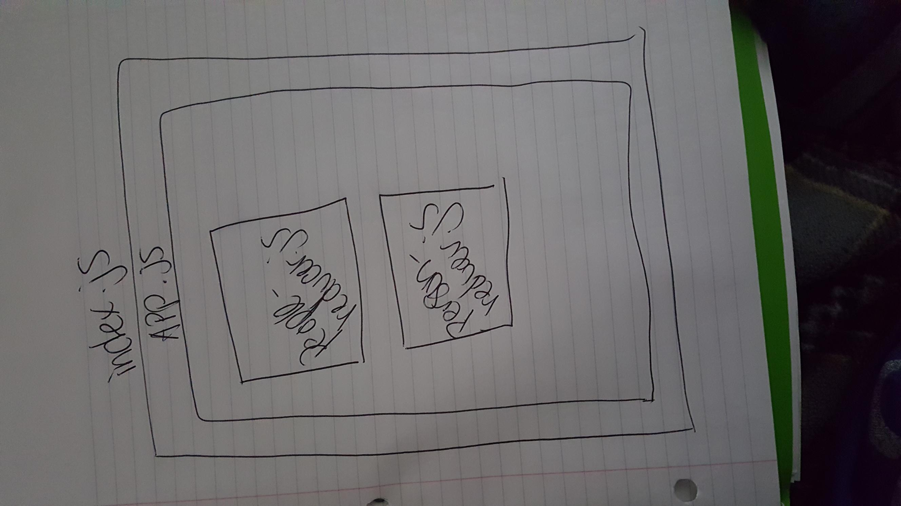

 LAB
=================================================

## LAB: Remote APIs

### Author: Siobhan Niess

## Assignment: Refactor A Star Wars Lookup App

### Links and Resources
* [repo](https://codesandbox.io/s/6x6ml0o0o3)
* [site](https://6x6ml0o0o3.codesandbox.io/)

### Modules
- `index.js` this renders the app
- `src/app.js` this holds all of thr elements that are going to be rendered
- `components/record/people-reducer.js` this file holds the people reducer
- `components/record/person-reducer.js` this file holds the person reducer
- `store/actions.js` this holds the actions and the API calls
- `store/index.js` this file holds the actions to set the reducers

#### UML
